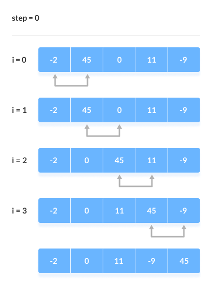

# Algorithm

### 1. Divide-and-Conquer Algorithm
- `Divide-and-Conquer` is an algorithm design paradigm which **recursively breaks problem into smaller units until they become simple enough to be solve directly**, and then **combines the result** to reach out to the solution.
- example usage: `quick sort`, `merge sort`, `Karatsuba algorithm`

### 2. Sorting Algorithm
- **Bubble Sort**

    - Simplest sorting algorithm which **compares 2 adjacent elements to get the biggest(smallest) element on each iteration**.
    - The iteration will go for (number of elements - 1).
    - **`O(N^^2)` performance**

- **Heap Sort**
    - Sorting algorithm using **`Heap` data structure to find min(max) value one by one**.
    - could be useful when sorting the entire elements is not necessary, but **only for extracting a few biggest** (smallest) values.
    - **`O(nlogn)` performance** (assuming that it's using binary heap)

- **Merge Sort**
    - Divide array in half till the size becomes one, and perform sorting when combining them. (`Divide-and-Conquer`)
    - **`O(nlogn)` performance**

- **Quick Sort**
    - Set **`Pivot` which will be the standard**, and place smaller elements on the left, greater elements on the right.
    - **`O(nlogn)`** but could show **`O(n**2)` in worst case if `Pivot` is not properly set** and does not effectively divide the array in half (left, right).
    - Example of worst case: When array is already sorted and `pivot` is set as the first element of the array (but this could be resolved if pivot is set as the median positioned element)

- **Merge sort vs Quick Sort**
    - They both show **`O(nlogn)` performance on average**, but **`Quick Sort` could show `O(n**2)` performance in the worst case** (depending on the pivot), whereas `Merge Sort` shows consistent performance.
    - **`Quick Sort` shows better performance with smaller sized array**, while **`Merge Sort` shows better performance with larger** ones.
    - **`Merge Sort` takes extra memory consumption** since sorting is **not done in place**.

- **Insertion Sort**
    - **Create a new array** and **insert items one by one into the array at appropriate position**.
    - **`O(n**2)`** performance on average and worst, but **`O(n)` at the best case (when the array is already sorted)**.