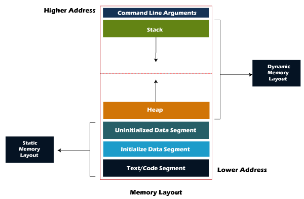

# Computer Science knowledge applied to overally regardless of domains

### 1. Memory Layout

- **Text/Code Segment (텍스트 영역 혹은 코드 영역)**: **Where codes of the program to execute is located**. When user executes a program, `OS` takes code from `HARD DISK` and places it here. Then the `CPU` would handle the operation inside here one by one.
- **Data Segment (데이터 영역)**: Where **`global variables` and `static variables`** are stored.
- **Heap Segment (힙 영역)**: Where **data created during `runtime`** is stored, and therefore the **size of this will be decided on `runtime`**. It is a memory area where programmer can manage, but for some languages (eg. `javascript`, `Java`) garbage collector does the job automatically.
- **Stack Segment (스택 영역)**: Where **`local variables` and `arguments` will be stored when a function is called**. The data will be **popped when the function has been terminated**.
- Data allocation of `Stack Segment` and `Heap Segment` will be done on `runtime` (Dynamic memory allocation)

### 2. Synchronous vs Asynchronous processing
- **Synchronous processing**
    - When a task is executed, the program waits till the task is finished, and continue the original task with the result.
    - Easy to control the processing because all the tasks are executed in order.
    - Cannot process multiple tasks simultaneously.
- **Asynchronous processing**
    - When a task is executed, the program continues on further tasks regardless of the requested task. The task would be executed independently.
    - Efficient resource control because you don't have to wait till the task is complete.
    - Difficult to control the overall flow of the process.
    - If a task is very heavy and could drop the performance on the resource control, or UX, UI, it would be better processed asynchronously.

### 3. Monolithic Architecture vs MicroService Architecture (MSA)
- MSA is an architecture introduced due to the limitations of existing Monolothic Architecture as the size of the application grows.

<table>
    <thead>
        <tr>
            <th> </th>
            <th>Definition</th>
            <th>Advantages</th>
            <th>Disadvantages</th>
        </tr>
    </thead>
    <tbody>
        <tr>
            <th>**Monolithic Architecture**</th>
            <td>
                Architecture of **implementing the entire system in one unit**.
            </td>
            <td>
                - Easy to setup dev environment (only have to setup things once)  
                - Simpler process of releasing/testing the application (especially with `e2e` testing)
            </td>
            <td>
                - Partial errors could affect the entire system.  
                - Heavy cost for build and test process (the process has to go through the entire part of the system even with small updates)  
                - Complexity of the code base as the system grows.  
                - Dependent on a single development environment (unable to choose different skills by requirements)  
                - Unable to partially `scale up` the system (increasing the number of servers to distribute the payload)
            </td>
        </tr>
        <tr>
            <th>**MicroService Architecture</th>
            <td>
                Architecture of **implementing the system in smaller units and combining them to organize the entire application**. Each component will **interact with each other via `APIs` and will not expose its internal logic**.
            </td>
            <td>
                - Able to develop each part of the system independently.  
                - Able to run test by each service.  
                - Able to choose appropriate skill for the requirements of the service.  
                - Able to choose the appropriate spec of the server based on the payload of of the service. (efficient way of partial scaling)  
                - Less possibility that partial error would break down the entire system.
            </td>
            <td>
                - API has to be implemented for connecting the distributed services.  
                - Effort needs to be given on how to synchronize the entire system (especially with DB transactions when error happens).  
                - Communication overhead between services.  
                - Effort for setting up tests related to other services or `e2e` tests.  
                - Relatively more difficult to monitor the entire system.
            </td>
        </tr>
    </tbody>
</table>