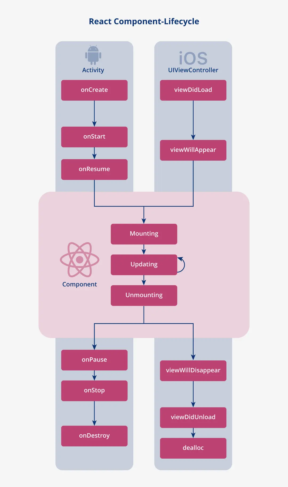

# React Native

### 1. React Native
- React Native (like React JS) uses Virtual DOM but the actual rendering is done by Native APIs (Java API, Object-C, ..)
    - It is not exactly a virtual "DOM" because React Native does not use DOM APIs, but it has a similar concept of using tree hierarchy to observe the updates and minimize updates. (updates are processed in batch just like it does in React JS)
- React Native uses dedicated elements types (eg. `View`, `Text`) which is converted to the appropriate native element of the OS platform.
- React JS uses React-Router whereas React Native uses React Navigation
- The rendering lifecycle of react native components follow the native lifecycle internally.

### 2. useFocusEffect
- `useFocusEffect` can be used to run side-effects when the screen is focused
- `useFocusEffect` is shares similar logic as `useEffect`, but does not take dependencies array as the second parameter.
- As `useEffect` works, the function passed to `useFocusEffect` could return a callback function the screen is no longer focused
- `useFocusEffect` would be triggered not only when the focused state of the screen changes, but also when the callback function given as parameter changes. Therefore the callback should be memoized with `useCallback` hook.
- To only trigger actions when the screen is "refocused", use reference with false as initial state. (otherwise the side-effect will run for the initial render focus as well)
- Unlike Web environment, React Native uses the concept of Stack, and the screen can maintain its state even if it loses focus. In those cases, initialization tasks could be used if necessary with `useFocusEffect`.
- In short, the following methods could be used with regards to focus state:
    - `AppState`: Add event listener to `AppState` change to see if the `App` is focused or not.
    - `useFocusEffect`: Set callback actions triggered when focus state of screen changes.
    - `useIsFocused`: Hook which returns boolean value expressing whether the screen is focused or not.