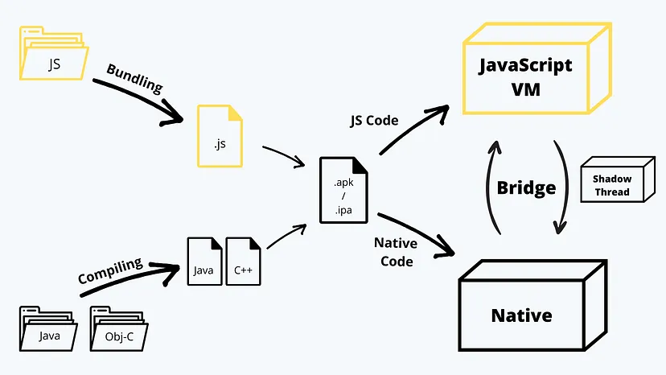

# React Native

### 1. React Native
- React Native (like React JS) uses Virtual DOM but the actual rendering is done by Native APIs (Java API, Object-C, ..)
    - It is not exactly a virtual "DOM" because React Native does not use DOM APIs, but it has a similar concept of using tree hierarchy to observe the updates and minimize updates. (updates are processed in batch just like it does in React JS)
- React Native uses dedicated elements types (eg. `View`, `Text`) which is converted to the appropriate native element of the OS platform.
- React JS uses React-Router whereas React Native uses React Navigation
- The rendering lifecycle of react native components follow the native lifecycle internally.

### 2. Build process of React Native application

(1) Native code (eg. Java, Object-C) will be compiled into Java or C++ binary files. 
(2) Javascript code will be bundled using *Metro bundler*. 
(3) Binaries of native code and javascript bundle will be packed into an executable (`.apk`, `.ipa`)

### 3. Runtime of React Native application
(1) User opens React Native application 
(2) OS creates `Main Thread` (UI Thread) 
(3) `Main Thread` loads Javascript bundle and spawns `Javascript Thread` and `Shadow Thread`. 
(4) Views written in javascript is sent to `Shadow Thread` and UI is calculated there. 
(5) `Shadow Thread` sends calculated result to the `Main Thread` which renders UI. 
(6) If components are re-rendered, React performs *diffing* algorithme, creates a new *Virtual Layout* (just like ReactJS does with Virtual DOM) and sends batched changes to `Shadow Thread`. 
(7) `Shadow Thread` does the calculation and sends the result to the `Main Thread` so that the updates could be applied. 
(8) If there's an event (eg. touch), the event is from `Main Thread` to the `Javascript Thread`. The update triggered by the event would follow the same process. 

- Native code will be executed directly on the device.
- Javascript code will be executed on a *Javascript Virtual Machine*.
    - *iOS* devices will use its built-in Javascript engine called `JavaScriptCore`.
    - *Android* doesn't have a built-in Javascript engine, so `JavaScriptCore` will be brought along with React Native Framework.

### 4. Native Bridege
- `Native Bridge` is a mechanism which enables the communication between the Javascript code and the Native part (every communication between the two goes through the Native Bridge).
- Communication through the `Native Bridge` requires serialization/deserialization, which is an expensive process.
- `Native Bridge` run asynchronously. (which could be an issue in several edge cases)
- Native Bridge is not a stand-alone thread, but a component which runs inside the `Main Thread`.

### 5. Threads running in React Native application
- UI Thread (=Main Thread)
    - Used for native rendering (the only thread that can render something on the screen)

- Javascript Thread
    - Used for running logic (javascript code) of the application.
    - At the end of each event loop, updates to native views are batched and sent to native side (the updates be delievered to the main thread before next frame rendering deadline which is decided by display FPS of the system)
    - Some updates of the native view could be done completely inside the UI thread with no Javascript thread involved, and therefore performs faster rendering without delay (eg. `NavigatorIOS`, `ScrollView`)

- Shadow Thread
    - Used for constructing a tree of layout (in a form that native system can understand) and performing UI calculation (eg. position, size)
    - *Before* Shadow thread was introduced: Main thread took care of everything (handling UI touch, UI calculation, UI rendering)
    - *After* Shadow thread was introduced: Shadow does UI calculation instead. This enables UI rendering on main thread being done while layout calculation is ongoing on shadow thread, which results in smoother and responsive UI.

- Native Modules Thread
    - Used when the application needs to access native platform API

### 6. JSI (Javascript Interface)
- New type of React Native Mechanism which enables direction connections between Javascript and the Native side.
- Introduced at v0.68 as a replacement of `Native Bridge` mechanism, because `Native Bridge` has a criticial impact on the performance of React Native application.
- Native methods, properties will be exposed via `HostObject`, and Javascript will have access to these using reference of the object.
- The communication based on JSI can be synchronous or asynchronous (synchronous if running on the same thread, otherwise asynchronous)

### 7. useFocusEffect
- `useFocusEffect` can be used to run side-effects when the screen is focused
- `useFocusEffect` is shares similar logic as `useEffect`, but does not take dependencies array as the second parameter.
- As `useEffect` works, the function passed to `useFocusEffect` could return a callback function the screen is no longer focused
- `useFocusEffect` would be triggered not only when the focused state of the screen changes, but also when the callback function given as parameter changes. Therefore the callback should be memoized with `useCallback` hook.
- To only trigger actions when the screen is "refocused", use reference with false as initial state. (otherwise the side-effect will run for the initial render focus as well)
- Unlike Web environment, React Native uses the concept of Stack, and the screen can maintain its state even if it loses focus. In those cases, initialization tasks could be used if necessary with `useFocusEffect`.
- In short, the following methods could be used with regards to focus state:
    - `AppState`: Add event listener to `AppState` change to see if the `App` is focused or not.
    - `useFocusEffect`: Set callback actions triggered when focus state of screen changes.
    - `useIsFocused`: Hook which returns boolean value expressing whether the screen is focused or not.