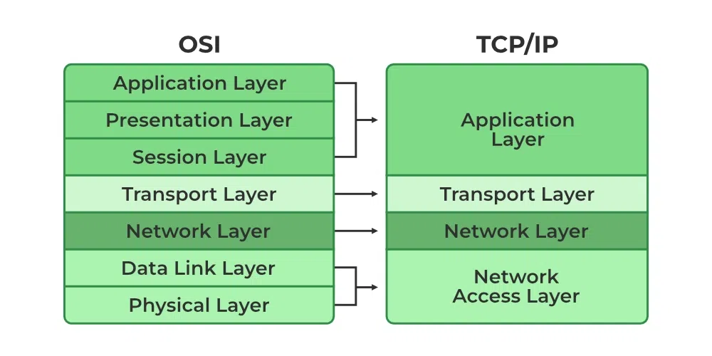

# Network

### 1. Process of entering a web page
(1) User **types URL** in the browser  
(2) The browser **requests DNS to find the ip address** corresponding to the domain name.  
(3) Using the obtained `ip address` and `port` (default is `80` for `HTTP`, `443` for `HTTPS`), **browser establishes `TCP` connection to the server (`3-way handshake` included).**  
(4) Server receives the request, processes it and sends the requested resource (eg. `HTML`)  
(5) Browser creates `Render Tree` out of `DOM Tree` and `CSSOM Tree`. Javascript is also fetched and executed to manipulate the tree.  
(6) Once all resources are loaded and javascript execution is complete, final layout is rendered and user can interact with the displayed webpage.  

### 2. DNS (Domain Name System) Lookup
- `DNS` is a hierarchical and distributed naming system for computers, services, and other resources in the Internet or other Internet Protocol (IP) networks.
- `DNS` translates `domain name` to `ip address`.
- Just like `Memory hierarchy`, there are multiple layers or factors of `DNS` for faster processing:
    - **Local DNS Cache**
        - **DNS cache stored in the local device**.
        - If the cached data is fresh, browser can obtain ip address immediately without accessing external DNS.
        - on `Windows`, DNS cached could be checked using `ipconfig/displaydns` command.

    - **Local DNS Server**
        - **First DNS server to look up for when domain name is given**
        - `Public DNS`: `Local DNS Server` people normally recall to. Provided in public (**usually by Internet service providers**)
        - `Private DNS`: `Local DNS Server` for storing internal sites and addresses. Only provided for internal purposes.
    
    - **Root DNS Server**
        - **Root of DNS Server which will return information about corresponding `TLD Server` for the Top Level Domain.**

    - **TLD (Top-Level-Domain) Server**
        - `DNS Server` which handles **all the information about a certain `Top Level Domain` which is `domain extension`** (eg. `.com`, `.kr`)
        - `Domain extension` could be either `generic TLD` (eg. `.com`, `.org`) or `country code TLD` (eg. `.kr`, `.jp`)
        - **`TLD Server` does not store cache data** but has information about all `Authoritative DNS Servers` of the `TLD`. **When a request is given, it returns information about the corresponding `Authoritative DNS Server` for the `domain`**.

    - **Authoritative DNS Server**
        - `Authoritative DNS Server` is the final holder of `ip address` information.
        - `Authoritative DNS Server` holds a; the `ip address records` for a certain `domain`.

    - **DNS Resolver (=Recursive DNS Server)**
        - Local system which will get the `domain name` from the result and return the translation result.
        - It first looks up for `local DNS Cache`, and then communicate with `Local DNS Server`

- **`DNS Cache` has `TTL (Time To Live)`** attribute which is used to **set when the cached data becomes stale**, and therefore has to be updated from higher level DNS.
- Starting from `Root DNS Server`, they do not *cache* the data.
- `DNS Servers` do not kindly query the `ip address` for you. It just returns information about the appropriate server where you might find the data. Then the `Local DNS Server` would do the actual interaction with the value.
- `DNS Servers` use `UDP` by default, but could use `TCP` as fallback (eg. packet size is too big to put in single `UDP Packet`)
- Detailed steps of `DNS lookup`:

(1) User types URL into the browser  
(2) `DNS Resolver` takes the given URL and searches `Local DNS Cache`.  
(3) If the cache doesn't exist, it queries `Local DNS Server`.  
(4) If the query fails, `Local DNS server` will ask the `ip address` to the `Root DNS Server`.  
(5) If fails, `Root DNS Server` will return information about the `TLD Server` of the Domain.  
(6) `Local DNS Server` would query `TLD Server` and it would return corresponding `Authoritative DNS Server` of the domain.  
(7) `Local DNS Server` would query `Authoritative DNS Server` will return the `ip address`.  
(8) `Local DNS Server` would tell `DNS Resolver` the returned `ip address` (could fail of course if the given `domain name` was incorrect).  
(9) `DNS Resolver` gives result to the browser so that it could send request to the server with the ip address.  

### 3. OSI 7-layer (OSI Model)

- `OSI Model` is a conceptual model from `ISO (International Organization for Standardization)` defining a common basis of developing an **interconnection system**.
- `OSI Model`splits communication systems into 7 abstract layers.
    - Each layer is stacked over another and can **use the functionality of the layer right below** or **provide functionality for the layer right above** (the layers can only interact with other adjacent layers)

    - **Application Layer (7)**
        - The only layer which **interacts directly with user's data**.
        - This is **not a client software application (eg. `browser`) but the layer those kinds of applications interact with**.
        - Example protocols: `HTTP`, `SMTP` (Simple Mail Transfer Protocol), `FTP`, ..
    
    - **Presentation Layer (6)**
        - Layer **preparing data in a way that the `Application Layer` can use (eg. translation, encryption, compression)**.
        - This enables communication between 2 devices which might have different encoding system, and also does compression to reduce communication cost when sending data.
        - So basically a layer which **formats the data so that the `Application Layer` can use or efficient for sending**.

    - **Session Layer (5)**
        - Layer responsible for **opening and closing communication** between two devices.
        - **`Session`: the time between when communication is opened and closed**.
        - **`Session Layer` ensures that `session` stays open during the transfer, and is closed immediately once transfer is complete** (avoid wasting resources).
        - `Session Layer` also sets **`checkpoints` in the middle of tranfer** for synchronization, so that **transfer could be resumed from the last checkpoint on crash or any errors**. (eg. set checkpoints on every 5mb for sending 100mb file)
    
    - **Transport Layer (4)**
        - Layer responsible for **reliable transmisison of data segments between two end-points**.
        - Also manages **flow control** (control optimal transmission speed) and **error control** (check if things are delivered correctly and retransfer if failed).
        - eg. `TCP`, `UDP`

    - **Network Layer (3)**
        - **Transform `segments` of `Transport Layer` to smaller units (`packet`) or reassemble them**.
        - **Find physical path between end-points (`Routing`)**
        - `Network Layer` is unnecessary if two end-points are on the same network.
        - eg. `IP`, `ICMP`, `IGMP`, `IPSec`
    
    - **Data Link Layer (2)**
        - Responsible for **data transfer for directly connected nodes**.
        - `Packets` from `Network Layer` will be split into `frames` here.
        - `Data Link Layer` is responsible for the following tasks between **two physically connected nodes**:
            - establish and terminate connection
            - flow control
            - error control

    - **Physical Layer (1)**
        - **Send data in `bit stream` (1 or 0) via physical equipment** (eg. `cable`, `switch`)

- Modern internets do not necessarily follow OSI model in a strict way, but still **`OSI Model` gives benefits narrowing down the issue while debugging**.
- To communicate on an `OSI Model` system, the data has to **go down 7 layers of the sender and go up 7 layers of the receiver**.

### 2. TCP/IP Model
- `TCP/IP Model` is a concise implementation model of communication system (unlike `OSI Model` which is a bit logical), introducced before the `OSI Model` but is most widely used.

- `TCP/IP Model` has 4 layers:
    - **Application Layer (4)**
        - Sum of `Session Layer`, `Presentation Layer`, `Application Layer` of `OSI Model`.
        - eg. `HTTP`, `SMTP`, `SNMP`, `FTP`, `SSH`
    
    - **Transport Layer (3)**
        - Same as `Transport Layer` of `OSI Model` (send data)
        - eg. `TCP`, `UDP`
    
    - **Internet Layer (2)**
        - Same as `Network Layer` of `OSI Model`.
        - eg. `IP`, `ARP`, `ICMP`

    - **Network Interface Layer(1)**
        - Sum of `Physical Layer` and `Data Link Layer` of `OSI Model`.

### 3. TCP vs UDP
- `TCP` and `UDP` are both protocols which applies to the `Transport Layer (4th layer)` of `OSI Model`. 

<table>
    <thead>
        <tr>
            <th> </th>
            <th>
                <strong>TCP (Transmission Control Protocol)</strong>
            </th>
            <th>
                <strong>UDP (User Datagram Protocol)</strong>
            </th>
        </tr>
        <tr>
            <th>
                <strong>Connection Type</strong>
            </th>
            <td>
                Requires established network before sending data (<strong>3-way Handshaking</strong>)</strong>
            </td>
            <td>
                No connection for sending data
            </td>
        </tr>
        <tr>
            <th>
                <strong>Ensure data order</strong>
            </th>
            <td>O</td>
            <td>X</td>
        </tr>
        <tr>
            <th>
                <strong>Deliver result check</strong>
            </th>
            <td>O (+ resend on failure)</td>
            <td>X</td>
        </tr>
        <tr>
            <th>
                <strong>Deliver result check</strong>
            </th>
            <td>O (+ resend on failure)</td>
            <td>X (Lost data cannot be retrieved)</td>
        </tr>
        <tr>
            <th>
                <strong>Communication method</strong>
            </th>
            <td>1:1</td>
            <td>1:1, 1:N, N:N (broadcasting possible)</td>
        </tr>
        <tr>
            <th>
                <strong>Overall</strong>
            </th>
            <td>Slow but relibale</td>
            <td>Fast but unreliable</td>
        </tr>
        <tr>
            <th>
                <strong>Suitable for</strong>
            </th>
            <td>
                - Sending files 
                - Web browsing 
                - Mails or Texts
            </td>
            <td>
                - Live Streaming 
                - Online Games 
                - Video Chats 
                - DNS (but uses TCP if the size if too big to put in one UDP packet)
            </td>
        </tr>
    </thead>
</table>

### 4. IP (Internet Protocol)
- `IP` is a protocol or ruleset for **routing and addressing `packets` so that data could travel accross network and arrive at correct destination**. (`Network Layer (3)` of `OSI Model`)
- **To each `packet`, IP information is attached** which would help `routers` to send the `packet` to the right place.
- **`IP Address`**: **Unique identifier assigned to a device or domain connected to the internet**. **For each `packet`, the `ip address` of the sender and the intended recipient will be added**.
- `IP Header`: Information added to `ip packets` to send the packet in the correct place.
    - `Header Length`
    - `Packet Length`
    - `TTL` (Time-to-Live)
    - `Transport Protocol` (eg. `TCP`, `UDP`)
- `IP` might send **packets towards same destination via different routes**. (for performance)
- Major versions of `Internet Protocol`:
    - `IPv4`
        - **address format**: **4 sets of numbers separated by dots** (**`32-bit` format** - allows 2**32 unique addresses)
        - eg. sample address: `192.0.2.1`
        - As the internet grew, there was limitation on the `ip addresses` we could make with `IPv4`. Therefore `IPv6` was introduced (still, `IPv4` is on the use)
    
    - `IPv6`
        - **address format**: **sets of numbers/letters separated by single or double colons** (**`128-bit` format** - allows 2**128 unique addresses)
        - eg. sample address: `2001:0db8:85a3:0000:0000:8a2e:0370:7334`
        - `IPv6` is concurrently used along with `Ipv4` (because so many web sites are already running on `IPv4`)

- `Static` vs `Dynamic` IP Address
    - `Static IP Address`
        - **`IP Address` that does not change**.
        - For most of the cases, `Static IP Address` is not required.
        - When to use `Static IP Address`: `VPN`, `Security purpose whitelist`, .. (so basically when you need external resource to have your ip address remembered)

    - `Dynamic IP Address`
        - **`IP Address` which is assigned when connected to network, and change over time**.
        - `Dynamic IP address` is used not only by client devices but also by servers. For servers, it is required to setup so dynamic `DNS` so that `DNS Entry` will be updated when the `Dynamic IP Address` of your server changes.
        - `Dynamic IP address` shows better resource management (since only devices connected to the internet would be assigned an address), and also supports mobile devices (eg. phone, laptop) which will frequently access via different newtwork.

- `Private` vs `Private` IP address
<table>
    <thead>
        <tr>
            <th> </th>
            <th>Private IP Address</th>
            <th>Public IP Address</th>
        </tr>
    </thead>
    <tbody>
        <tr>
            <th>Scope</th>
            <td>Local Reach (communication within private network)</td>
            <td>Global Reach (communication over the internet)</td>
        </tr>
        <tr>
            <th>Address assign</th>
            <td>By Router</td>
            <td>By ISP</td>
        </tr>
        <tr>
            <th>Range</th>
            <td>
                - 10.0.0.0 - 10.255.255.255 
                - 172.16.0.0 - 172.31.255.255 
                - 192.168.0.0 - 192.168.255.255
            </td>
            <td>Any IP outside Private IP range</td>
        </tr>
    </tbody>
</table>

### 5. Addressing Methods
- **`Unicast`**: Transferring a message **to one specific node** (`one-to-one`). (eg. Web Browsing, File Transfer)
- **`Broadcast`**: Transferring a message to **all recipients simultaneously** (`one-to-all`). (eg. TV broacasting, software updates)
- **`Muxlticast`**: Transferring a message to **a group of nodes** (`one-to-many` or `many-to-many`)
- **`Anycast`**: Transferring  a message to **any one of the potential receivers node group** (usually set by `distance` or `transfer cost` based on `routing algorithm`). (eg. CDN, DNS)

### 6. HTTPS
- `Protocol` which added encryption to `HTTP` for security reasons.
- Uses `SSL certificate` which contains website's `public key` and other information of the website.
- `SSL` certificate is based on `SSL (Secure Socket Layer)` or `TLS (Transport Layer Security)` techniques. `TLS` is an improved verseion of `SSL`, but people just say that `HTTPS` is based on `TLS` for convenience.
- Because using `Asymmetric Key (비대칭키)` for every comunication takes heavy cost, it is only used once to create classified `Symmetric key (대칭키)` at the beginning.
- Detailed steps of `SSL Handshake` in `HTTPS` communication:
    - `Client Hello`:**`Client` initiates the communication**
        - **Encryption methods client can use**
        - **Random value** - which will be used to create the `Symmetric key`.

    - `Server Hello`: Server gives response
        - `Cipher suite`: **Encryption method that the server chose**
        - **`SSL certificate` containing the `public key` of the server**. (is **encryptyed by CA `private key`** - Certificate Authority)
        - **Server generated random value**

    - **`Client` validates the received `SSL certificate`**.
        - Browser has a list of trusted `CA` and their `public keys`.
        - `Client` will try to see if the `CA` is in the list, and the `SSL` is decrypted with the `public key` of the `CA`.
        - If the `SSL certificate` is considered `invalid`, browser will throw warning.

    - **`Client` creates `Premaster secret`**
        - `Premaster secret` is created using two random values created from each side (this will be used to create `session key`).
        - The **client will encrypt `Premaster secret` by public key of the server, and send it to the server**.

    - **`Server` creates `Session key` from received `Premaster Secret`**
        - `Server` gets will decrypt received `premaster secret` and obtain `master secret`.
        - Now, both `Client` and the `Server` have `pre-master secret`. They will give it along with other information as input of `PRF (Pseudo-Random Function)` to create the `Session Key`.

    - **`Server` and `Client` will use this `Session key` as `Symmetric Key` along with `agreed cryptographic algorithm` till the `Session` expires**.