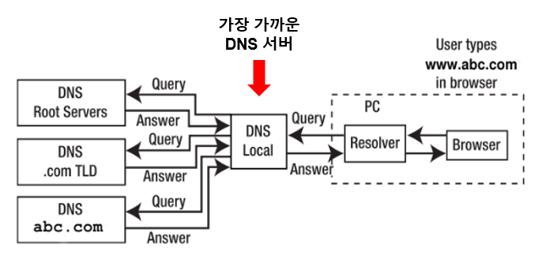

# Network

### 1. Process of entering a web page
(1) User **types URL** in the browser  
(2) The browser **requests DNS to find the ip address** corresponding to the domain name.  
(3) Using the obtained `ip address` and `port` (default is `80` for `HTTP`, `443` for `HTTPS`), **browser establishes `TCP` connection to the server (`3-way handshake` included).**  
(4) Server receives the request, processes it and sends the requested resource (eg. `HTML`)  
(5) Browser creates `Render Tree` out of `DOM Tree` and `CSSOM Tree`. Javascript is also fetched and executed to manipulate the tree.  
(6) Once all resources are loaded and javascript execution is complete, final layout is rendered and user can interact with the displayed webpage.  

### 2. DNS (Domain Name System) Lookup
- `DNS` is a hierarchical and distributed naming system for computers, services, and other resources in the Internet or other Internet Protocol (IP) networks.
- `DNS` translates `domain name` to `ip address`.
- Just like `Memory hierarchy`, there are multiple layers or factors of `DNS` for faster processing:
    - **Local DNS Cache**
        - **DNS cache stored in the local device**.
        - If the cached data is fresh, browser can obtain ip address immediately without accessing external DNS.
        - on `Windows`, DNS cached could be checked using `ipconfig/displaydns` command.

    - **Local DNS Server**
        - **First DNS server to look up for when domain name is given**
        - `Public DNS`: `Local DNS Server` people normally recall to. Provided in public (**usually by Internet service providers**)
        - `Private DNS`: `Local DNS Server` for storing internal sites and addresses. Only provided for internal purposes.
    
    - **Root DNS Server**
        - **Root of DNS Server which will return information about corresponding `TLD Server` for the Top Level Domain.**

    - **TLD (Top-Level-Domain) Server**
        - `DNS Server` which handles **all the information about a certain `Top Level Domain` which is `domain extension`** (eg. `.com`, `.kr`)
        - `Domain extension` could be either `generic TLD` (eg. `.com`, `.org`) or `country code TLD` (eg. `.kr`, `.jp`)
        - **`TLD Server` does not store cache data** but has information about all `Authoritative DNS Servers` of the `TLD`. **When a request is given, it returns information about the corresponding `Authoritative DNS Server` for the `domain`**.

    - **Authoritative DNS Server**
        - `Authoritative DNS Server` is the final holder of `ip address` information.
        - `Authoritative DNS Server` holds a; the `ip address records` for a certain `domain`.

    - **DNS Resolver (=Recursive DNS Server)**
        - Local system which will get the `domain name` from the result and return the translation result.
        - It first looks up for `local DNS Cache`, and then communicate with `Local DNS Server`

- **`DNS Cache` has `TTL (Time To Live)`** attribute which is used to **set when the cached data becomes stale**, and therefore has to be updated from higher level DNS.
- Starting from `Root DNS Server`, they do not *cache* the data.
- `DNS Servers` do not kindly query the `ip address` for you. It just returns information about the appropriate server where you might find the data. Then the `Local DNS Server` would do the actual interaction with the value.
- Detailed steps of `DNS lookup`:

(1) User types URL into the browser  
(2) `DNS Resolver` takes the given URL and searches `Local DNS Cache`.  
(3) If the cache doesn't exist, it queries `Local DNS Server`.  
(4) If the query fails, `Local DNS server` will ask the `ip address` to the `Root DNS Server`.  
(5) If fails, `Root DNS Server` will return information about the `TLD Server` of the Domain.  
(6) `Local DNS Server` would query `TLD Server` and it would return corresponding `Authoritative DNS Server` of the domain.  
(7) `Local DNS Server` would query `Authoritative DNS Server` will return the `ip address`.  
(8) `Local DNS Server` would tell `DNS Resolver` the returned `ip address` (could fail of course if the given `domain name` was incorrect).  
(9) `DNS Resolver` gives result to the browser so that it could send request to the server with the ip address.  

### 3. OSI 7-layer (OSI Model)

- `OSI Model` is a conceptual model from `ISO (International Organization for Standardization)` defining a common basis of developing an **interconnection system**.
- `OSI Model`splits communication systems into 7 abstract layers.
    - Each layer is stacked over another and can **use the functionality of the layer right below** or **provide functionality for the layer right above** (the layers can only interact with other adjacent layers)

    - **Application Layer (7)**
        - The only layer which **interacts directly with user's data**.
        - This is **not a client software application (eg. `browser`) but the layer those kinds of applications interact with**.
        - Example protocols: `HTTP`, `SMTP` (Simple Mail Transfer Protocol), `FTP`, ..
    
    - **Presentation Layer (6)**
        - Layer **preparing data in a way that the `Application Layer` can use (eg. translation, encryption, compression)**.
        - This enables communication between 2 devices which might have different encoding system, and also does compression to reduce communication cost when sending data.
        - So basically a layer which **formats the data so that the `Application Layer` can use or efficient for sending**.

    - **Session Layer (5)**
        - Layer responsible for **opening and closing communication** between two devices.
        - **`Session`: the time between when communication is opened and closed**.
        - **`Session Layer` ensures that `session` stays open during the transfer, and is closed immediately once transfer is complete** (avoid wasting resources).
        - `Session Layer` also sets **`checkpoints` in the middle of tranfer** for synchronization, so that **transfer could be resumed from the last checkpoint on crash or any errors**. (eg. set checkpoints on every 5mb for sending 100mb file)
    
    - **Transport Layer (4)**
        - Layer responsible for **reliable transmisison of data segments between two end-points**.
        - Also manages **flow control** (control optimal transmission speed) and **error control** (check if things are delivered correctly and retransfer if failed).
        - eg. `TCP`, `UDP`

    - **Network Layer (3)**
        - **Transform `segments` of `Transport Layer` to smaller units (`packet`) or reassemble them**.
        - **Find physical path between end-points (`Routing`)**
        - `Network Layer` is unnecessary if two end-points are on the same network.
        - eg. `IP`, `ICMP`, `IGMP`, `IPSec`
    
    - **Data Link Layer (2)**
        - Responsible for **data transfer for directly connected nodes**.
        - `Packets` from `Network Layer` will be split into `frames` here.
        - `Data Link Layer` is responsible for the following tasks between **two physically connected nodes**:
            - establish and terminate connection
            - flow control
            - error control

    - **Physical Layer (1)**
        - **Send data in `bit stream` (1 or 0) via physical equipment** (eg. `cable`, `switch`)

- Modern internets do not necessarily follow OSI model in a strict way, but still **`OSI Model` gives benefits narrowing down the issue while debugging**.
- To communicate on an `OSI Model` system, the data has to **go down 7 layers of the sender and go up 7 layers of the receiver**.